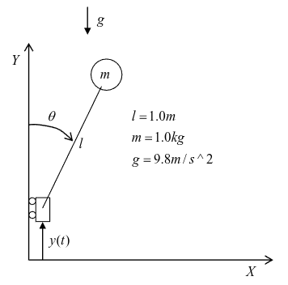
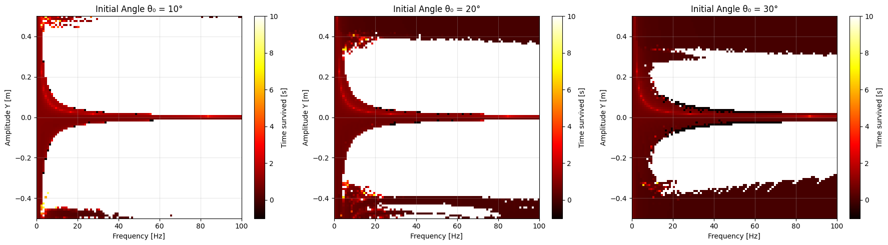
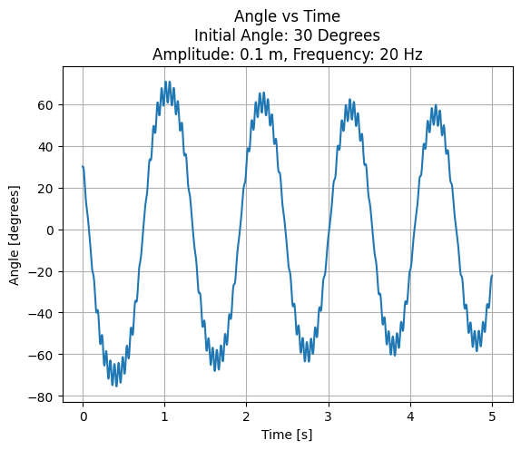
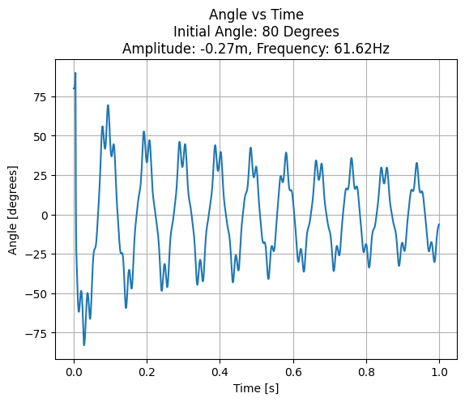
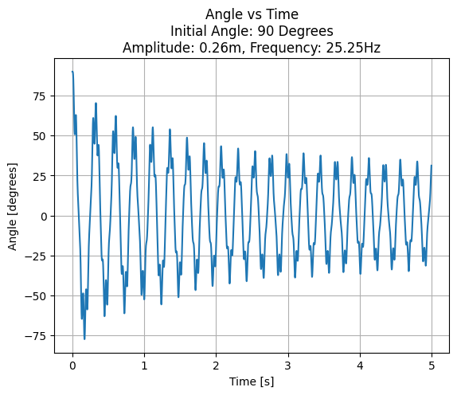

## Scenario:
This inverted pendulum with vertical base excitation is pretty interesting. An analysis can be done which shows that if ( )y t is oscillated harmonically at some frequency and amplitude, the pendulum will be stable and will return to a vertical up position after being displaced by some
angle, θ.

## Simulation:
A time-step simulation modeling the above inverted pendulum system was created in Python in order to map the cart's amplitude-frequency parameter space and find stable systems. The parameter space was defined having its amplitude rangeing from -0.5 to 0.5 (negative amplitude indicating that the cart begins moving downward rather than upward) and frequency ranging from 0 to 100 Hz. For a given amplitude and frequency, a ten second simulation is performed for a maximum of 10 seconds with 1 ms time steps. Each simulation is scored by its time spent in the simulation, with stable systems reaching the max time and systems whose pendulum reaches a critical max angle (95 degrees used for the following results) are terminated early. Six initial displacement angles from the upright position were selected to investigate the stable behavior at high and low angles.
## Results:
Stable simulations reached the maximum time spent in their simulations and are all colored white in the heatmaps below. The untable regions are colored according to their time-to-failure in the simulation, creating a red gradient. While investigating points along the region boundary, a new mode of stability revealed itself, neither converging to the upright position nor falling to chaotic movements, rather stabilizing in a horizontal alignment, nearly parallel to the ground. Because the lab assignment had defined stability as oscillating about the vertical position, these horizontally aligned situations will be referred to as "pseudo-stable" and are remapped to black pixels on the heatmaps below.

Heatmaps for small initial displacements (10, 20, and 30 degrees)

Stable System Time Evolution

Pseudo-Stable System Time Evolution

The same simulations were performed at higher initial angles and revealed more narrow stable regions and similar interesting behaviors.

Heatmaps for Large Initial Displacements (70, 80, 90 degrees)

Stable System at 80 Degrees Initial Displacement

Stable System at 90 Degrees Initial Displacement

## Comments
- By filtering unstable systems with a max critical angle, only systems that converge from the beginning are labeled as stable and pseudo-stable, so the heatmaps should be treated as a subset of the true parameter space. 
- There is a distinct local maximum line in each heatmap's unstable region that may be worth further investigation. 
